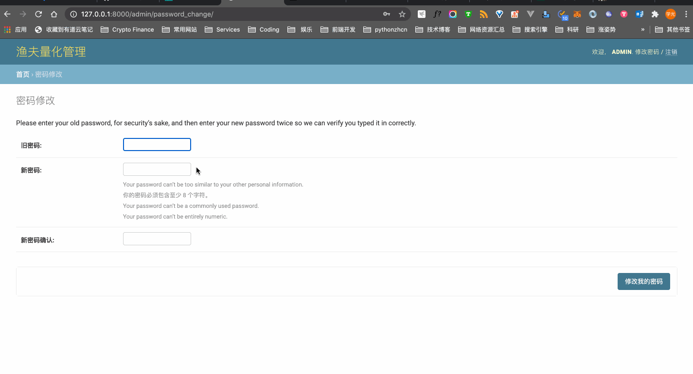

# 账户

在部署渔夫数字货币量化系统时，数据库初始化脚本会生成一个默认的超级用户，生成后请立即登录管理台进行安全性相关的配置。

## 修改账户密码

数据库初始化脚本生成的超级用户密码都是相同的，请在生成后立即登录管理台修改默认密码。

修改账户密码的步骤：

1. 点击顶部导航条右上角的 『修改密码』选项；
2. 填写修改密码表单的各项数据；
3. 点击『修改我的密码』提交修改。

👇 演示了整个修改密码的过程：

