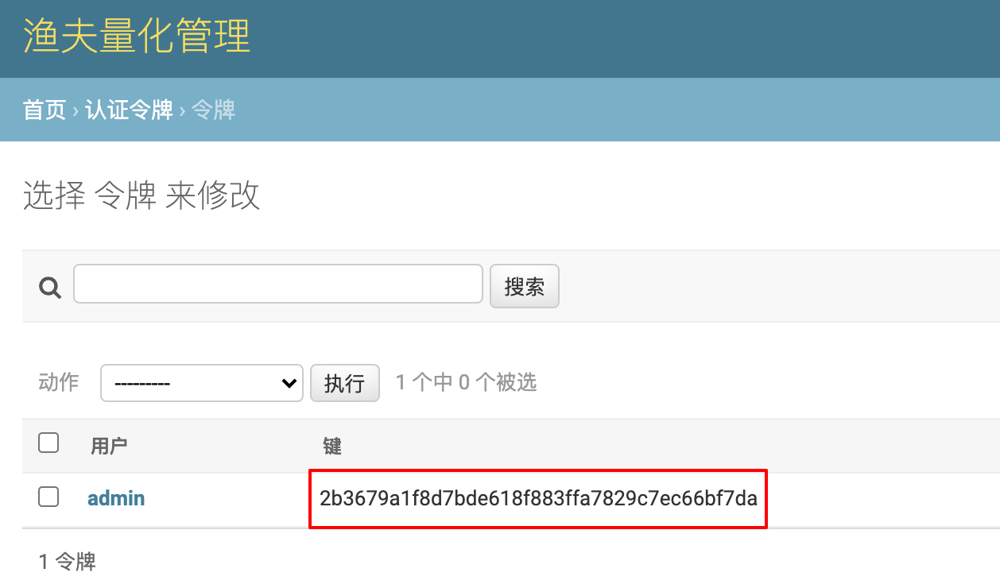

# 认证令牌

认证令牌用于 API 调用的身份校验。交易机器人在运行过程中会不断与渔夫量化系统后端 API 进行交互，读取、增加或者修改系统的数据，所以 API 请求必须通过认证令牌进行身份校验，以确认其有相应的操作权限。

当前版本下，为了启动交易机器人，需要为机器人配置认证令牌。

认证令牌查询步骤：

1. 登录管理台；
2. 找到『认证令牌』板块，点击『令牌』进入令牌列表页；
3. 『键』列的值即为用户对应的认证令牌。

👇 图中红框圈出部分就是超级用户 admin 的认证令牌：

