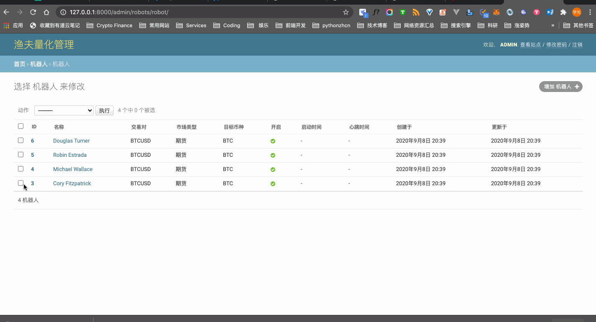

# 机器人资产记录

渔夫量化交易系统的机器人状态卡片显示了机器人交易的资产数据，包括收益率、本金、余额等。

将来的版本中我们会加入自动设置资产数据的功能，但当前版本需要管理台手动录入总投资金额才可正确计算收益率。

管理台手动录入总投资金额的步骤：

1. 登录管理台；
2. 找到『机器人』板块，点击『机器人』进入机器人列表页；
3. 点击机器人的名称进入对应机器人的详情页；
4. 在页面底部「资产记录」表单中修改总投资金额、总余额数据项；
5. 点击「保存」完成录入总投资金额的操作。

👇 演示了整个录入总投资金额的过程：

