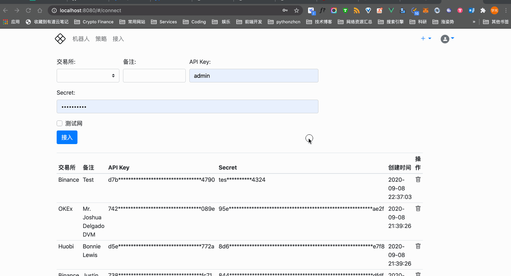

# 管理交易所凭据

### 添加交易所凭据

添加交易所凭据的步骤：

1. 登录渔夫系统；
2. 点击顶部导航条的「接入」导航项；
3. 填写表单中各项数据；
4. 点击「接入」完成添加交易所凭据的操作。

表单中各项数据说明：

| 数据项  | 说明                                                         |
| ------- | ------------------------------------------------------------ |
| 交易所  | 待接入的交易所。如果选项中没有，可以在管理台 [添加交易所](admin/exchange.md#交易所) |
| 备注    | 备注信息。同一交易所可能添加多个凭据，设置备注信息便于区分。 |
| API Key | 在数字货币交易所创建的 API Key & Secret 中的 API Key。       |
| Secret  | 在数字货币交易所创建的 API Key & Secret 中的 Secret。        |
| 测试网  | 标注该凭据是测试网还是正式网。很多交易所都有测试网，可以在测试网中进行模拟交易。 |

!!! seealso
    [快速使用：接入交易所](./quickstart.md#接入交易所)

## 删除交易所凭据

可删除不再使用的交易所凭据。

删除交易所凭据的步骤：

1. 登录渔夫系统；
2. 点击顶部导航条的「接入」导航项；
3. 在已接入的交易所凭据列表中，点击待删除项对应的「删除」按钮；
4. 在弹出的确认框中，点击「确认」完成删除交易所凭据的操作；或者点击「取消」取消本次删除操作。

!!! warning
    删除交易所凭据将同时删除使用此凭据进行交易的机器人，这将导致机器人无法执行后续交易。

👇 演示了整个操作流程：

