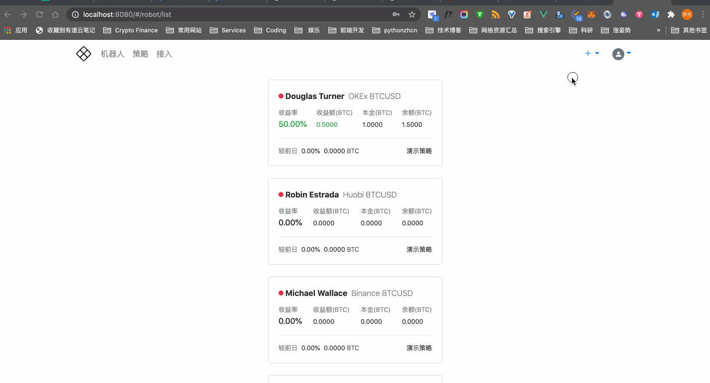
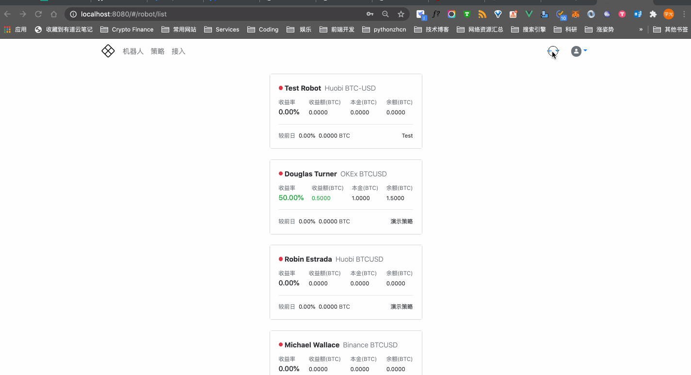

# 快速使用

在渔夫量化交易系统创建并启动策略机器人，快速开启量化交易之旅。

## 接入交易所

几乎所有的数字货币交易所都支持通过 API 接口进行委托交易，而无需登录交易所网站或 APP 进行操作。为了让机器人执行委托交易，首先需要接入指定交易所，也就是把在数字货币交易所创建的接口访问凭据（在数字货币交易所网站上通常叫做 API Key & Secret）添加到渔夫量化系统。

接入交易所的步骤：

1. 登录渔夫量化系统；
2. 点击顶部导航条的「接入」导航项；
3. 在添加交易所凭据的表单中输入各项数据（各项数据的详细说明可参考 [添加交易所凭据：表单中各项数据说明](credential.md#添加交易所凭据)）；
4. 点击「接入」完成接入交易所的操作。

👇 演示了整个操作流程：

!!! tip
    可以在表单下方的表格中查看所有已接入的交易所和 [删除交易所凭据](credential.md#删除交易所凭据)。

!!! important
    渔夫量化系统存储的交易所凭据都已经过加密处理。此外，大部分交易所都支持设置凭据的接口访问权限（例如仅允许委托交易而不允许提币）、允许访问的 IP 白名单等。为了资金安全，请仔细遵照交易所的安全文档，妥善管理好凭据的使用权限。

## 添加策略

交易机器人需选定一种交易策略来执行交易，不同的交易策略对应不同的风险和收益。除了使用渔夫量化交易系统的内置策略以外，还可以添加任何遵循 [渔夫量化通用交易策略规范]() 的自定义策略。

添加策略的步骤：

1. 登录渔夫量化交易系统；
2. 点击顶部导航条右上角的「+」导航项；
3. 在弹出的列表中点击「策略」；
4. 在添加策略的表单中输入各项数据；
5. 点击「+」完成策略添加的操作。

👇 演示了整个操作流程：

!!! note
    「策略参数规格」必须遵循 [渔夫量化通用交易策略规范]()，作为起步可以参考 [这个例子]()。

## 创建机器人

接入交易所和添加策略后，就可以创建交易机器人。

创建机器人的步骤：

1. 登录渔夫量化交易系统；
2. 点击顶部导航条右上角的「+」导航项；
3. 在弹出的列表中点击「机器人」；
4. 在创建机器人的表单中输入各项数据；
5. 点击「创建」完成创建机器人的操作。

👇 演示了整个操作流程：

## 启动机器人

参考示例。

!!! tip
    机器人运行过程中，可以 [监控机器人运行状态]() 和 [调整交易策略参数]()。

💐 恭喜！你已成功开启了渔夫数字货币量化交易之旅。