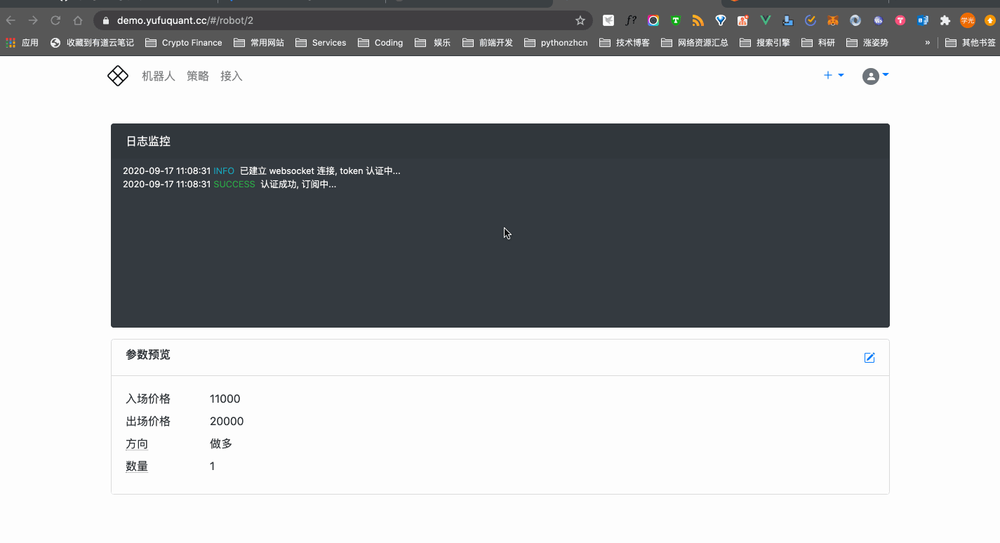

# 管理机器人

## 创建机器人

创建机器人的步骤：

1. 登录渔夫系统；
2. 点击顶部导航条右上角的「+」导航项；
3. 在弹出的列表中点击「机器人」；
4. 在机器人表单输入各项数据；
5. 点击「创建」完成创建机器人的操作。

表单中各项数据说明：

| 数据项     | 说明                                                         |
| ---------- | ------------------------------------------------------------ |
| 名字       | 机器人名字。设置机器人名字便于区分不同机器人。               |
| 交易所凭据 | 机器人将使用此凭据在数字货币交易所执行委托交易。             |
| 交易对     | 资产交易对，例如 BTCUSDT。不同交易所支持的交易对不同，关于交易对信息，请参考 [交易对信息](appendixes/pair.md) |
| 市场类型   | 指定机器人交易期货（交割合约、永续合约均归为期货类别）还是现货。 |
| 目标币种   | 想赚取的币种。期货交易只能赚取保证金币种，现货交易既可赚取基础币种，也可赚取计价币种，目标币种设置的不同将影响机器人执行的交易策略，也会影响资产收益率的统计方式。 |
| 基础币种   | 仅现货需设置。通常现货交易的交易对已经包含了基础币种的信息，这个数据项仅为了方便机器人进行资产数据的获取和回传。需保证与交易对中包含的基础币种信息一致。 |
| 计价币种   | 仅现货需设置。通常现货交易的交易对已经包含了计价币种的信息，这个数据项仅为了方便机器人进行资产数据的获取和回传。需保证与交易对中包含的计价币种信息一致。 |
| 策略       | 机器人将使用此策略执行委托交易，不同策略对应不同的风险和收益。 |
| 启用       | 是否启用机器人。启用后允许机器人执行交易，否则机器人将进入休息状态，直到该机器人被启用。 |

!!! seealso
    [快速开始：创建机器人](robot.md#创建机器人)

## 修改机器人

机器人创建后，目前只能修改「名字」和「启用」状态。

修改机器人数据的步骤：

1. 登录渔夫系统；
2. 点击顶部导航条的「机器人」导航项；
3. 鼠标悬停在待修改的机器人条目上，点击出现的编辑按钮；
4. 在编辑表单输入各项数据；
5. 点击「更新」完成修改机器人的操作。

## 删除机器人

不再使用的机器人可以删除。

删除机器人的步骤：

1. 登录渔夫系统；
2. 点击顶部导航条的「机器人」导航项；
3. 鼠标悬停在待删除的机器人条目上，点击出现的删除按钮，弹出删除确认框；
5. 点击「确认」完成删除操作；点击「取消」取消本次删除操作。

## 启动机器人

当前的版本，在渔夫系统创建机器人后，需要手动运行对应策略的机器人脚本。关于如何启动机器人，请参考 [快速使用：启动机器人](quickstart.md#启动机器人)。

!!! tip
    后续版本渔夫系统将支持一键启动机器人。

## 监控机器人运行状态

目前有 2 个地方可以监控机器人的运行状态：一个是机器人列表页的卡片；另一个是机器人详情页的机器人运行日志。

机器人列表页的卡片如下：

左上角（机器人名字左边）的状态点指示了机器人的运行情况。如果是跳动的绿点，说明机器人正在运行；如果是红点，说明机器人已经停止运行。

点击卡片上机器人的名称可进入机器人详情页，在「日志监控」板块可查看机器人运行时回传的实时日志信息。

## 调整策略参数

我们鼓励开发者提供交易策略的核心参数的修改功能，以便适应瞬息万变的行情。因为交易策略遵循 [渔夫量化策略规范](https://yufuquant.github.io/yufuquant/specification/)，所以可以在渔夫系统内轻松修改交易策略参数。

调整策略参数的步骤：

1. 登录渔夫系统；
2. 进入机器人详情页；
3. 在「日志监控」下方的「参数预览」可预览当前交易策略参数；
4. 点击「参数预览」面板右上角的编辑按钮，弹出「参数设置」表单；
5. 在表单中输入各项数据；
6. 点击「确认」完成调整策略参数的操作。

👇 演示了整个操作流程：

